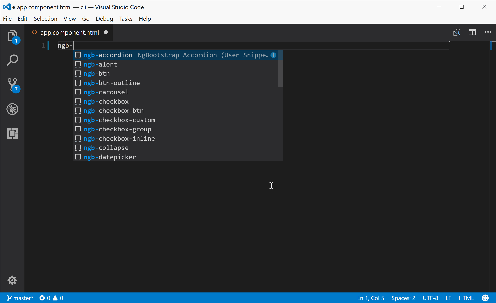

# NgBootstrap Snippets

A set of [NgBootstrap](https://ng-bootstrap.github.io) ([Angular](https://angular.io/) + [Bootstrap 4](http://getbootstrap.com/)) Snippets for Visual Studio Code.

## Usage
Type ngb to see the list of the available snippets, select a snippet then press `enter` and the snippet unfolds.

## Available Snippets

 Trigger | Description
--- | ---
ngb-accordion | Accordion 
ngb-alert | Alert 
ngb-btn | Button 
ngb-btn-outline | Button Outline
ngb-carousel | Carousel 
ngb-checkbox | Checkbox (Default)
ngb-checkbox-btn | Checkbox - Button
ngb-checkbox-custom | Checkbox - Custom style
ngb-checkbox-inline | Checkbox  - Default Inline 
ngb-checkbox-group | Checkbox buttons group 
ngb-collapse | Collapse 
ngb-datepicker | Datepicker
ngb-datepicker-popup | Datepicker Popup 
ngb-dropdown | Dropdown 
ngb-pagination | Pagination 
ngb-modal | Modal
ngb-popover-placement | Popover With Placement
ngb-progressbar | Progress bar
ngb-radio | Radio button (Default)
ngb-radio-btn | Radio button - Button
ngb-radio-Cusom | Radio button - Custom style
ngb-radio-inline | Radio button - Default Inline
ngb-radio-group | Radio buttons group
ngb-rating | Rating
ngb-rating-readonly | Rating (ReadOnly) 
ngb-tab | Tab 
ngb-tab-custom-title | Tab (Custom title) 
ngb-tabset | Tabset 
ngb-tabset-justify | Tabset Justify
ngb-timepicker | Timepicker 
ngb-timepicker-meridian | Timepicker Meridian 
ngb-timepicker-steps | Timepicker Steps 
ngb-tooltip | Tooltip 
ngb-tooltip-placement | Tooltip With Placement
ngb-typeahead | Typeahead 

---
## Installation

1. Install Visual Studio Code 0.10.1 or higher
2. Launch Code
3. From the command palette `Ctrl`-`Shift`-`P` (Windows, Linux) or `Cmd`-`Shift`-`P` (OSX)
4. Select `Install Extension`
5. Choose the extension
6. Reload Visual Studio Code

---
[Github](https://github.com/ktriek/ng-bootstrap-snippets/)

## License

This Visual Studio Code extension is open-source software licensed under the [MIT license](http://opensource.org/licenses/MIT).